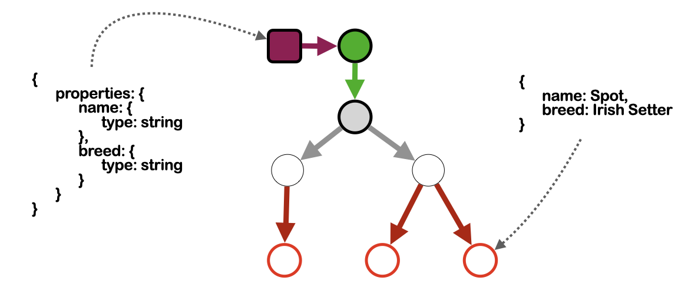

back to [TIPs for the Concept Graph main page](https://github.com/wds4/tapestry-protocol/blob/main/tips/concept-graph/README.md)

TIP 1.1.1
=====

constraints
-----

a.k.a. formats
-----

## Statement of the principle

According to this principle of organization: if a constraint node is connected directly to any node of a class thread proximal to the class instance (to any node other than the class instance node), then that class instance node must validate according to the constraints of the constraint node.

-----

## Explanation

In most cases, a constraint node will be a `json schema`. Usually it will be connected directly to the class origin node via a relationship of type: `isTheJsonSchemaFor` and will therefore apply to every instance of that concept, as depicted in the figure below.

This TIP describes the function of the `constraint` node type.

The purpose of a constraint node is to assert constraints on other nodes. Stated another way: a constraint node provides formatting rules that are expected to be followed by other nodes.

Constraint nodes will typically be connected via a specialized path, typically only one hop in length, to a class thread. The 

Because the tapestry protocol relies heavily upon json, the principal type of constraint node in the tapestry protocol will be the `json schema`. However, other types of constraint nodes may be added later.

## Example

  

The purple square is a *constraint node*. It specifies formatting rules that must be followed by each instance of that concept (red circles). In the figure, each node represents a JSON file. The constraint node specifies that each instance must have two properties, name and breed, the values of which must be strings. The file for Spot follows this format, as expected.
