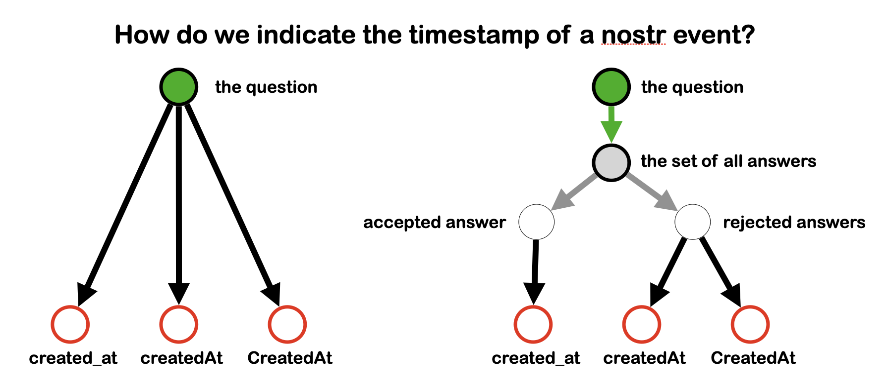

back to [TIPs: Core Protocol main page](https://github.com/wds4/tapestry-protocol/blob/main/tips/core-protocol/README.md)

### TIP-0.1.1
the Grapevine: curation of knowledge using the web of trust
=====

`draft` `author:wds4`

## Synopsis

The tapestry protocol will provide methods for entities to delegate curation of knowledge to the web of trust, referred to as the *Grapevine*, and will be done so in a manner designed to pair well with the Concept Graph. In other words, the Concept Graph will be used to formulate a question; the Grapevine will be used to answer it.

## Discussion

The general idea is that the Concept Graph will be used to formulate questions, and the Grapevine can be used to answer them.

*Curation of knowledge* refers to various categories:
- answers to linguistic (pseudo-arbitrary) questions, e.g.: what do we call a particular object?
- answers to subjective questions, e.g.: what is the best movie of all time?
- answers to objective questions, e.g.: is the moon made of cheese?

## Example

An example of a pseudo-arbitrary question would be the one in the following figure: *How do we indicate the timestampt of a nostr event?*

First, the question must be represented using the Concept Graph, as illustrated in the figure below.

As shown in the figure above, the question is represented by a single node (circles with a green background). Proposed answers are represented by individual nodes (circles with red borders). The answers are grouped into a set using edges that connect the question to each answer. Two different connection methods are used. On the left, the question is connected directly to each propsoed answer. On the right, the question is connected to each proposed answer by a specialized path, called a class thread, consisting of two or more edges in sequence. The method on the right has the advantage that answers can be organized into subsets (circles with thin borders). Class threads will be discussed in detail in a later TIP.

Second, the Grapevine is used to answer the question. Importantly, each node is represented by a *universally unique identifier*. Entities can express their preference via attestations to that effect. Attestations will be collected by an entity and synthesized into a final answer using weighted average, with the weight of any given attestation dependent upon the influence of the attestation's author.

There is no guarantee that Alice's Grapevine will produce for her the same answer that Bob's Grapevine produces for him. However, pseudo-arbitrary questions are characterized by the fact that most entities want more than anything else to be on the same page as everyone else in their community. Therefore, the tendency will be that Alice and Bob likely will end up with the same answer to the same question. In the example above, the answer would be *created_at*. This same method can be used to ask and then answer any pseudo-arbitrary question. In this manner, an entire language can be curated without the need for stewards.

We refer to this tendency for non-contentious pseudo arbitrary linguistic questions to yeild the same answer as *loose consensus*.

The same general method can be used to ask questions that are not linguistic in nature, i.e. questions of subjective opinion or objective fact. 

